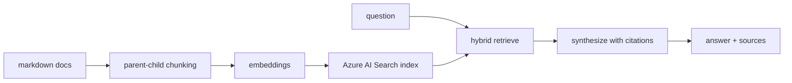

## Overview

We stood up a production-style RAG pipeline on Microsoft Foundry: Azure OpenAI
(`gpt-4.1-mini` + `text-embedding-3-large`), Azure AI Search (free tier),
`azure-ai-evaluation`, and a one-command deployment with Bicep + `az`. The happy
path is a 20-minute job. Ours took a day — and almost none of it went into the
pipeline itself. It went into deployment, lifecycle, and tooling.

Here is every wall we hit, with the fix.



## 1. The model version you picked is probably retired by now

**Symptom**

```
InvalidTemplateDeployment ... ServiceModelDeprecated:
The model 'Format:OpenAI,Name:gpt-4o-mini,Version:2024-07-18' has been
deprecated since 03/31/2026 00:00:00.
```

**Cause** Azure OpenAI retires *specific versions* on a schedule. Hardcoding a
version in IaC is a time bomb.

**Fix** Discover what is deployable in your region at deploy time and try
candidates in order — `az cognitiveservices model list` is the source of truth:

```powershell
$models = az cognitiveservices model list --location $Location -o json | ConvertFrom-Json
foreach ($p in @("gpt-4.1-mini","gpt-5-mini","gpt-5.4-mini")) {
    $m = $models | Where-Object { $_.model.name -eq $p } | Select-Object -First 1
    if ($m) { ...deploy $m.model.name $m.model.version...; break }
}
```

**Lesson** Never pin a model *version* in Bicep unless you will maintain it. Treat
the version as data, not a constant.

## 2. `gpt-5`-class models reject the `Standard` SKU

**Symptom**

```
InvalidResourceProperties: The specified SKU 'Standard' of account deployment
is not supported by the model 'gpt-5-mini' version '2025-08-07'.
```

**Cause** Reasoning-class models are offered on `GlobalStandard` (and other
global/data-zone SKUs), not regional `Standard`.

**Fix** Choose the SKU per model family:

```powershell
function Get-ChatSku($name) {
    if ($name -like 'gpt-5*' -or $name -like 'o1*' -or $name -like 'o3*' -or $name -like 'o4*') {
        return 'GlobalStandard'
    }
    return 'Standard'
}
```

**Lesson** "Deploy a model" is a three-variable problem: model, **version**, and
**SKU**. Two of three still fails.

## 3. A deleted resource group does not free the account name

**Symptom**

```
FlagMustBeSetForRestore: An existing resource with ID '.../accounts/ragpipeline-xxxx'
has been soft-deleted. ... please purge it first.
```

**Cause** Deleting a Foundry/AI Services account *soft-deletes* it. The name stays
reserved.

**Fix** Purge before recreating, or use a fresh name:

```powershell
az cognitiveservices account purge --name <account> --resource-group <rg> --location <region>
az cognitiveservices account list-deleted -o table
```

**Lesson** Teardown is not a clean slate.

## 4. Retrying a failed deployment can deadlock the parent resource

**Symptom**

```
RequestConflict: Another operation is being performed on the parent resource
'.../accounts/ragpipeline-xxxx'. Please try again later.
```

**Cause** Our first template bundled the account **and** the model deployments.
Every retry re-submitted the whole template, re-touching the account while the
previous operation was still finalizing.

**Fix** Split the deploy: create the account + Search **once**, then create each
model deployment separately so retries only touch the deployment.

```powershell
az cognitiveservices account deployment create `
  --name $account --resource-group $rg `
  --deployment-name gpt-4-1-mini `
  --model-name gpt-4.1-mini --model-version 2025-04-14 --model-format OpenAI `
  --sku-name Standard --sku-capacity 50
```

**Lesson** Retried operations must be as narrow as possible.

## 5. Windows PowerShell's `Set-Content -Encoding UTF8` adds a BOM

**Symptom** `python-dotenv` reads the first key as `\ufeffAZURE_OPENAI_ENDPOINT`,
so your app reports a *missing* env var even though the file looks perfect.

**Cause** In Windows PowerShell 5.1, `-Encoding UTF8` writes a UTF-8 **BOM**.

**Fix** Write `.env` without a BOM:

```powershell
[System.IO.File]::WriteAllText($path, $content, (New-Object System.Text.UTF8Encoding($false)))
```

**Lesson** "It's just a text file" is how half a day disappears.

## 6. `Write-Host ("=" * 64) -ForegroundColor ...` silently mis-parses

**Symptom** Your banner prints the literal text `- ForegroundColor DarkGray`.

**Cause** After a parenthesized expression, PowerShell can treat the following
`-Parameter` as a positional string.

**Fix** Assign to a variable first:

```powershell
$Bar = "=" * 64
Write-Host $Bar -ForegroundColor DarkGray
```

**Lesson** PowerShell argument mode is subtle after parenthesized expressions.

## 7. A PowerShell function returns all its output — including your exit-code test

**Symptom** A verification script always reported `FAIL` even though the command
succeeded.

**Cause** The helper returned the command's stdout *and* `$LASTEXITCODE`:

```powershell
function Invoke-Rag($args) {
    & python -m ragpipeline @args
    return $LASTEXITCODE   # but stdout was emitted too!
}
if ((Invoke-Rag @("ingest")) -ne 0) { ... }   # array "ingested 3 chunks",0 -> truthy
```

**Fix** Capture output, then return only the code:

```powershell
$out = & python -m ragpipeline @args 2>&1
$code = $LASTEXITCODE
$out | ForEach-Object { Write-Host $_ }
return $code
```

**Lesson** In PowerShell, unwritten output is the return value.

## 8. `$ErrorActionPreference = "Stop"` turns native stderr into a crash

**Symptom** Probing `py -3.12 --version` aborted the script with
`NativeCommandError: No suitable Python runtime found`.

**Cause** With `Stop`, a native command writing to stderr becomes terminating.

**Fix** Probe defensively:

```powershell
$probe = (& py $v --version 2>&1) -join " "
if ($LASTEXITCODE -eq 0) { ... }
```

**Lesson** Handle native exit codes explicitly.

## 9. Capacity is bounded by quota — and Standard quota may be near-zero

**Symptom** `ask` works, but the evaluation harness retries for minutes and dies
with `RateLimitError: ... exceeded token rate limit`, even at `capacity: 50`.

**Cause** An Azure OpenAI Standard deployment's `capacity` is thousands of tokens
per minute, and it is capped by your *subscription* quota. Our real-time
`Standard.gpt4.1-mini` quota was the bottleneck; `GlobalStandard` had headroom.

```powershell
az cognitiveservices usage list --location eastus `
  --query "[?contains(name.value,'Standard')].{name:name.value, limit:limit, used:currentValue}" -o table
```

**Fix** Deploy the chat model on `GlobalStandard`, and/or point evaluators at a
separate deployment:

```python
model_config = {
    "azure_endpoint": os.environ["AZURE_OPENAI_ENDPOINT"],
    "api_key": os.environ["AZURE_OPENAI_API_KEY"],
    "azure_deployment": os.environ.get("EVAL_DEPLOYMENT_NAME", MODEL_DEPLOYMENT_NAME),
}
```

**Lesson** Separate serving traffic from evaluation traffic. Query quota with
`--query` — the table view truncates wide names.

## 10. You forgot FinOps until the bill arrived

**Fix** Tag everything at deploy time and give dev resources an expiry:

```bicep
var commonTags = {
  project: projectName
  environment: environment
  owner: owner
  costCenter: costCenter
  managedBy: 'bicep'
  workload: 'ai-103-portfolio'
  dataClassification: 'public'
  expiresOn: expiresOn   // drives an automated cleanup job
}
```

Then add a subscription budget plus a `cleanup-expired` job that deletes groups
whose `expiresOn` has passed, and report by tag in Cost Management.

**Lesson** Cost attribution is a day-one concern, not a cleanup task.

## 11. Azure AI Search lets you add fields, never remove them

**Symptom**

```
OperationNotAllowed: Existing field(s) 'chunk_index' cannot be deleted.
```

**Cause** Azure AI Search indexes are not fully mutable.

**Fix** Reset (delete + recreate) the index when the schema changes, and make it
first-class:

```powershell
python -m ragpipeline ingest --recreate
```

**Lesson** Treat the index schema as a versioned artifact. A migration you can't
roll back needs a rebuild path.

## Extras

The pre-flight checklist we now use:

- [ ] Model **name + version + SKU** discovered from the region, not hardcoded
- [ ] Account/Search deployed **once**; model deployments applied separately
- [ ] Auth: keys for local dev, managed identity + RBAC for prod
- [ ] `.env` written **without BOM**
- [ ] `capacity` sized for the heaviest consumer (usually the evaluators)
- [ ] Evaluators can target a **separate deployment**
- [ ] Every resource tagged; dev resources carry `expiresOn`
- [ ] Budget + alert configured
- [ ] `teardown` and `cleanup-expired` scheduled
- [ ] Idempotent provisioning: re-running never breaks a healthy stack

None of these are RAG problems. They are **platform-operations** problems —
lifecycle, SKUs, IaC idempotency, Windows tooling, and cost. That is the gap
between "I wrote a RAG demo" and "I can operate this in Azure."

## Links

- Code: [enterprise-rag-pipeline](https://github.com/koatedevopskpai/enterprise-rag-pipeline)
- Next post in the series: [We built three retrieval modes and they tied](/posts/data-mlops/002-retrieval-mode-benchmark-three-modes-tied/)
- [Azure OpenAI model retirements](https://learn.microsoft.com/azure/ai-services/openai/concepts/model-retirements)
