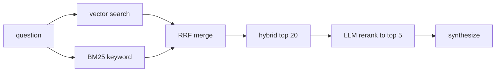
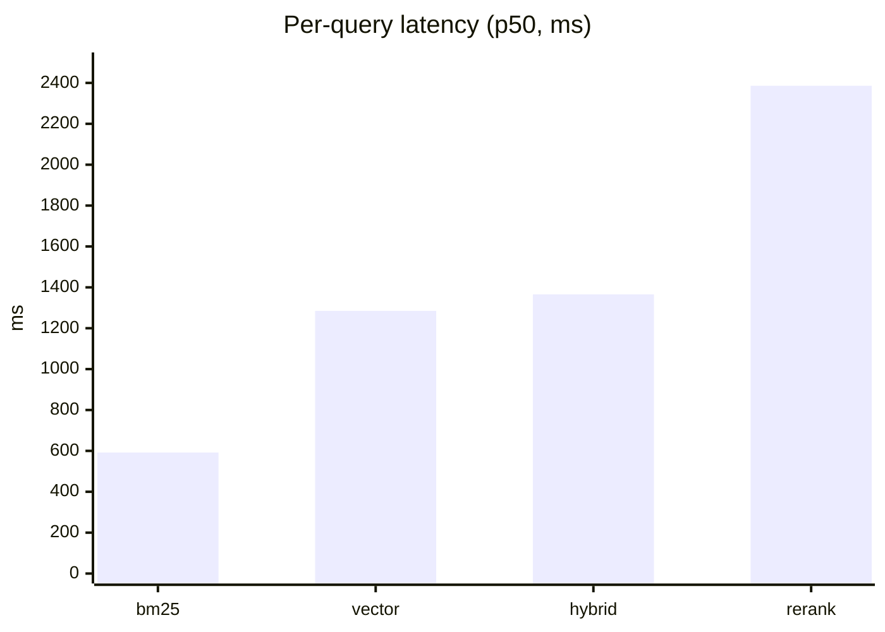

## Overview

Every RAG tutorial tells you to "use hybrid search" and "add a reranker." Few
show the measurement that justifies either. So we built a pluggable retrieval
layer with four strategies and benchmarked them on harder synthetic queries:

- **bm25** — keyword only (Azure AI Search full-text leg, no vectors)
- **vector** — pure embedding similarity
- **hybrid** — keyword + vector, fused with reciprocal rank fusion
- **hybrid_rerank** — hybrid candidates re-ranked by the LLM

The honest takeaways, up front: **identifier/lexical queries are a BM25 win;
paraphrase-style queries are a hybrid win over vector; and the LLM reranker
added about a second of latency without beating either.** This post is the
harness, the numbers, and the limits of what they mean.

## The benchmark

Deterministic metrics, per query: **hit rate @5**, **hit rate @1**, **MRR**, and
**nDCG @5**, plus the **rank of the expected source** (no LLM-as-judge noise;
retrieval-only mode makes zero API calls).

Corpus and queries:

- **80 near-duplicate synthetic policy docs**, each with a unique reference code
  (`REF-9K2MNP`) and a numeric limit.
- Four query types, 20 each (80 queries): bare code, code + context,
  paraphrase-of-limit, and ambiguous topic. Designed so lexical hits, semantic
  hits, and genuinely unsolvable queries all appear.

## The results

Rerank pool: hybrid retrieves the top 20 parents; the LLM re-orders to top 5.

### At a glance — H@5 by query set

```mermaid
xychart-beta
    title "H@5 by query set (80 synthetic docs)"
    x-axis [Bare, Context, Paraphrase, Ambiguous]
    y-axis "H@5" 0 --> 1
    bar [1, 1, 1, 0.4]
    bar [0.95, 0.95, 0.9, 0.35]
    bar [0.9, 0.95, 0.95, 0.4]
    bar [0.9, 0.9, 0.9, 0.4]
```

(Bar order for each query set: BM25, vector, hybrid, hybrid_rerank.)

### 1. Bare reference codes (lexical lookup)

| Mode | H@5 | H@1 | MRR | nDCG@5 |
|---|---|---|---|---|
| bm25 | 1.00 | 1.00 | 1.00 | 1.00 |
| vector | 0.95 | 0.95 | 0.95 | 0.95 |
| hybrid | 0.90 | 0.90 | 0.90 | 0.90 |
| hybrid_rerank | 0.90 | 0.90 | 0.90 | 0.90 |

### 2. Code with context

| Mode | H@5 | H@1 | MRR | nDCG@5 |
|---|---|---|---|---|
| bm25 | 1.00 | 1.00 | 1.00 | 1.00 |
| vector | 0.95 | 0.95 | 0.95 | 0.95 |
| hybrid | 0.95 | 0.95 | 0.95 | 0.95 |
| hybrid_rerank | 0.90 | 0.90 | 0.90 | 0.90 |

### 3. Numeric paraphrase (explicit limit)

| Mode | H@5 | H@1 | MRR | nDCG@5 |
|---|---|---|---|---|
| bm25 | 1.00 | 1.00 | 1.00 | 1.00 |
| vector | 0.90 | 0.55 | 0.70 | 0.75 |
| hybrid | 0.95 | 0.90 | 0.93 | 0.93 |
| hybrid_rerank | 0.90 | 0.90 | 0.90 | 0.90 |

> Note: the query names the exact limit value, so BM25 also solves this set
> (1.00) — it is still a keyword hit. The interesting signal is **hybrid vs
> vector** (MRR 0.93 vs 0.70): the keyword leg rescues dense retrieval on precise
> values. A true semantic paraphrase with no shared tokens is a follow-up test,
> not part of this set.

### 4. Ambiguous topic (deliberately underspecified)

| Mode | H@5 | H@1 | MRR | nDCG@5 |
|---|---|---|---|---|
| bm25 | 0.40 | 0.00 | 0.10 | 0.17 |
| vector | 0.35 | 0.00 | 0.11 | 0.17 |
| hybrid | 0.40 | 0.00 | 0.12 | 0.19 |
| hybrid_rerank | 0.40 | 0.00 | 0.12 | 0.19 |

### Measured latency (per query, paraphrase set, n=20)

| Mode | avg | p50 | p95 |
|---|---|---|---|
| bm25 | 601 ms | 592 ms | 737 ms |
| vector | 1308 ms | 1285 ms | 1497 ms |
| hybrid | 1389 ms | 1366 ms | 1527 ms |
| hybrid_rerank | 2363 ms | 2386 ms | 2568 ms |

## What this means

1. **Lexical/identifier queries are a BM25 problem.** On exact codes, the
   keyword-only leg hit 1.00 while vector/hybrid were 0.90–0.95. That confirms
   the review's suspicion: earlier "ties" were because those sets were lookup
   tests. If your retrieval is identifier lookups, you may not need embeddings at
   all — and it's the cheapest mode by far (no query embeddings, ~0.6 s).
2. **Hybrid beats vector where the query has precise tokens.** On the
   numeric-paraphrase set, MRR is 0.93 (hybrid) vs 0.70 (vector): the keyword leg
   catches the exact value dense vectors miss, for ~80 ms extra. BM25 also solves
   these, so it is a keyword rescue of dense retrieval, not semantic recall.
3. **The reranker added a second and gained nothing here.** p50 went from ~1.4 s
   to ~2.4 s and recall did not improve on any set. It will help when a crowded,
   borderline candidate list needs re-ranking — that is not what these sets are.
4. **Ambiguous queries defeat everyone, and that's a query problem.** All four
   modes sit at ~0.35–0.40 H@5 and 0.00 H@1. No retrieval mode can find a signal
   that isn't there. The product-level fix is a **clarifying question** — when
   top candidates all score about equally, ask the user instead of guessing.

## What I'd run next

This is a sanity check, not the end of the story. Three follow-ups would complete it:

- **A genuinely semantic paraphrase set** (low or zero lexical overlap with the
  target). Does hybrid still beat vector when there is no precise token to match,
  and does BM25 fall off the way dense results should?
- **A crowded-candidate set** — 10+ documents scoring near-equally for one
  correct answer — to actually test whether the reranker improves H@1 / nDCG and
  whether its ~1 s is worth it. That is the reranker's purpose-built scenario,
  and it is untested here.
- **More queries + confidence intervals** for stable H@1 / MRR / nDCG (and stable
  p95 latency).

The generator (`scripts/generate_eval_corpus.py`) and `compare_modes.py` already
accept the knobs (`--docs`, `--queries`, `QUERY_TYPE` filters) to build these.

## Threats to validity

- **Synthetic, near-duplicate corpus.** Shared boilerplate makes the unique
  token the dominant signal; a best case for embeddings, not a stand-in for
  diverse production data.
- **Small sample.** 80 queries per type; no confidence intervals. Treat as a
  sanity check, not a posterior over retrieval modes.
- **The "paraphrase" set is numeric lookup.** Queries name the exact limit, so
  BM25 also solves them (that's why it hits 1.00); genuinely semantic
  low-overlap queries are a separate, harder benchmark — listed in "What I'd run
  next."
- **Latency is local, serial, coldish.** These are per-call timings from one dev
  box; treat as relative, not absolute.

## Extras

- Run it yourself: `eval/compare_modes.py` with `SKIP_LLM_EVAL=1`,
  `GOLDEN_PATH=eval/golden_set_large.jsonl`, and `QUERY_TYPE` = one of
  `exact_code_bare`, `exact_code_context`, `paraphrase_limit`, `ambiguous_topic`.
- `bm25` is a first-class mode (keyword only — no embeddings).
- Ingestion is the only real token cost (~320 vectors, cents).

## Takeaway

A reproducible benchmark beats a cherry-picked winner. The takeaway isn't "use
hybrid" or "skip reranking" in the abstract — it's: default to hybrid, add a
reranker only when ranking is the bottleneck (and measure it), and for
identifier lookups consider **BM25 alone**. The deliverable is the harness you
can point at your own corpus.

## Links

- Code: [enterprise-rag-pipeline](https://github.com/koatedevopskpai/enterprise-rag-pipeline) —
  `ragpipeline/strategies.py`, `ragpipeline/rerank.py`, `eval/compare_modes.py`,
  `scripts/generate_eval_corpus.py`
- Previous post: [Deploying RAG on Microsoft Foundry](/posts/data-mlops/001-foundry-rag-gotchas/)
- [Azure AI Search hybrid ranking (RRF)](https://learn.microsoft.com/azure/search/hybrid-search-ranking)