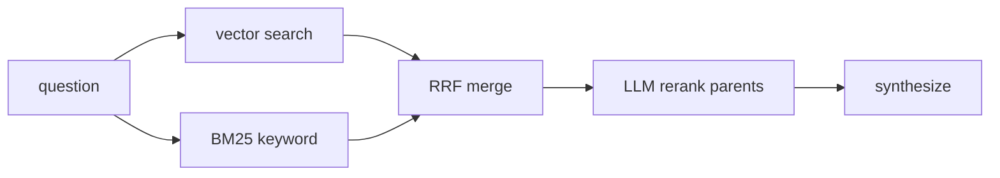

## Overview

Every RAG tutorial tells you to "use hybrid search" and "add a reranker." Few
show the measurement that justifies either. We built a pluggable retrieval layer
with three strategies and a deterministic benchmark — and the honest result is:
on our corpora, **all three modes tied**.

The negative result is the point. Here's the harness that proved it.

## The three modes

- **vector** — pure embedding similarity over child chunks.
- **hybrid** — keyword (BM25) + vector, fused with reciprocal rank fusion.
- **hybrid_rerank** — hybrid candidates (top 20 parents), re-ranked to the top 5
  by the LLM before synthesis.

All three return deduplicated parent sections with their text and section title.

## The benchmark

Two things make a retrieval benchmark trustworthy:

1. **A deterministic metric.** We measure **hit-rate@5** (was the expected source
   in the top 5?) and **MRR** (mean reciprocal rank of the first correct hit). No
   LLM-as-judge noise, no API calls — fast, free, and stable.
2. **A hard query set.** Easy questions saturate and tell you nothing. So we
   generated a synthetic corpus: 80 near-duplicate policy documents, each with a
   unique reference code (`REF-9K2MNP`) and limit. Queries ask for exact codes.

## The results

**Hit-rate@5 and MRR**, measured on the final 5 candidates. Rerank candidate
pool: hybrid retrieved the top 20 parents, the LLM re-ordered them down to 5.

| Corpus | Queries | vector (Hit@5 / MRR) | hybrid (Hit@5 / MRR) | hybrid_rerank (Hit@5 / MRR) |
|---|---|---|---|---|
| Curated policies | 16 | 1.00 / 1.00 | 1.00 / 1.00 | 1.00 / 1.00 |
| 80 synthetic, code + context | 80 | 0.95 / 0.95 | 0.95 / 0.95 | 0.95 / 0.95 |
| 80 synthetic, bare codes | 80 | 0.95 / 0.95 | 0.95 / 0.95 | 0.95 / 0.95 |

We expected vector to fall over on random tokens. It didn't.

Read the MRR column carefully: it equals hit-rate in every row, because whenever
the expected source was recovered it was already **rank 1**. That is the ceiling
effect, and it is exactly why the reranker row cannot improve — the metric is
saturated before a reranker ever sees the list.

A size caveat, so this is read as what it is: an **illustrative validation run,
not a proof benchmark**. 16 curated + 80 synthetic queries is small; a swing of
1–2 queries is ~1%.

## Why they tied

Three effects, in order of importance:

1. **Ceiling effect on clean data.** When the ground truth is already rank 1, a
   downstream reranker has nowhere to go. Rerankers earn their latency when the
   candidate list holds dozens of *loosely* relevant documents — not when the
   target is already the top hit.
2. **Controlled token isolation.** Our synthetic policies shared nearly identical
   boilerplate, so the unique reference code was the dominant differentiator in
   embedding space. That is an unnatural, low-noise condition. It tells you nothing
   about how `REF-9K2MNP` behaves inside a diverse, noisy production corpus — it
   only shows the needle dominated the cosine delta here.
3. **Hybrid subsumes dense search.** Azure AI Search fuses BM25 and dense vectors
   with reciprocal rank fusion. When dense retrieval already surfaces ground truth
   at rank 1, the keyword leg adds no net recall.

## What this actually means

- **Default to hybrid.** It never recalls less than vector, and on Azure AI Search
  the extra cost is negligible — RRF is native, no extra service, no extra calls.
  It's insurance, not a silver bullet.
- **Rerank only when ranking is the bottleneck — and count the cost.** The LLM
  reranker pays a token cost per ranked candidate and adds ~200–800 ms of tail
  latency per query. When hit-rate is high but top-1 accuracy is not, that buys
  something; when recall is already solved (our data), it buys nothing.
- **Measure on your data.** Retrieval-mode choice is empirical. Our result is
  specific to a small, clean, synthetic corpus — a diverse production corpus may
  separate the modes sharply. Now you have the harness to find out.

## Extras

- The benchmark runs with `SKIP_LLM_EVAL=1`, so it makes **zero** LLM calls.
- `QUERY_TYPE` filters the golden set (e.g. `exact_code_bare` vs `exact_code_context`).
- Ingestion is the only real cost (~320 vectors, cents).

## The takeaway

A negative result you can reproduce beats a cherry-picked win. The deliverable
isn't "hybrid is best" — it's a pluggable retrieval layer plus a deterministic
benchmark and a corpus generator you can point at your own data. That's the
difference between a demo and an engineering decision.

## Links

- Code: [enterprise-rag-pipeline](https://github.com/koatedevopskpai/enterprise-rag-pipeline) —
  `ragpipeline/strategies.py`, `ragpipeline/rerank.py`, `eval/compare_modes.py`,
  `scripts/generate_eval_corpus.py`
- Previous post: [Deploying RAG on Microsoft Foundry](/posts/data-mlops/001-foundry-rag-gotchas/)
- [Azure AI Search hybrid ranking (RRF)](https://learn.microsoft.com/azure/search/hybrid-search-ranking)
