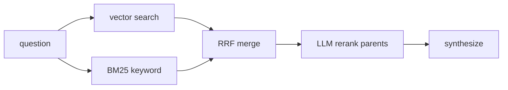

## Overview

Every RAG tutorial tells you to "use hybrid search" and "add a reranker." Few
show the measurement that justifies either. We built a pluggable retrieval layer
with a deterministic benchmark — and the honest result is: **on a small, clean,
near-duplicate, synthetic corpus, all four retrieval modes tied.**

The negative result is the point. Here is the harness that proved it, the
reasons the numbers came out the way they did, and the limits of what they mean.

## The modes

- **bm25** — keyword only, Azure AI Search's full-text leg (no vectors).
- **vector** — pure embedding similarity over child chunks.
- **hybrid** — keyword (BM25) + vector, fused with reciprocal rank fusion.
- **hybrid_rerank** — hybrid candidates (top 20 parents), re-ranked to the top 5
  by the LLM before synthesis.

All four return deduplicated parent sections with their text and section title.

## The benchmark

Two things make a retrieval benchmark trustworthy:

1. **Deterministic metrics.** We measure **hit-rate@5**, **hit-rate@1**, **MRR**,
   and **nDCG@5** (no LLM-as-judge noise; zero API calls in retrieval-only mode),
   plus the **rank of the expected source** per query so nothing is summarized away.
2. **Queries aimed at the hard case for dense retrieval.** We generated an
   80-document near-duplicate policy corpus, each doc with a unique reference
   code (`REF-9K2MNP`) and a limit, and asked for the exact codes — with and
   without surrounding context. As flagged below, that makes these more *lexical*
   lookups than semantic ones.

## The results

Metrics are measured on the **final 5 candidates**. Rerank pool: hybrid retrieved
the top 20 parents; the LLM re-ordered down to 5. Dense and keyword legs share the
same top-20 window, so hit-rates compare like for like.

| Set | Docs | Queries | Metric | vector | hybrid | hybrid_rerank |
|---|---|---|---|---|---|---|
| Curated policies | 16 | 16 | H@5 / H@1 / MRR / nDCG | 1.00 / 1.00 / 1.00 / 1.00 | 1.00 / 1.00 / 1.00 / 1.00 | 1.00 / 1.00 / 1.00 / 1.00 |
| Synthetic (code + context) | 80 | 20 | H@5 / H@1 / MRR / nDCG | 0.95 / 0.95 / 0.95 / 0.95 | 0.95 / 0.95 / 0.95 / 0.95 | 0.95 / 0.95 / 0.95 / 0.95 |
| Synthetic (bare codes) | 80 | 20 | H@5 / H@1 / MRR / nDCG | 0.95 / 0.95 / 0.95 / 0.95 | 0.95 / 0.95 / 0.95 / 0.95 | 0.95 / 0.95 / 0.95 / 0.95 |

Every row is saturated: **H@1 = MRR = nDCG@5 = H@5**, because whenever the expected
source was recovered it was already **rank 1**. A reranker cannot improve a metric
that is saturated before it runs — and Hit@5 cannot change by construction when
the pool and the final-five window are the same size.

We expected vector to fall over on random tokens. It didn't.

A **BM25-only baseline** is wired into the harness (`compare_modes.py` includes a
`bm25` mode) but wasn't regenerated after the resources were torn down. On these
exact-code queries it is *expected to tie*: they are lexical lookups and keyword
matching alone solves them — which is exactly why this set exercises keyword
matching, not vector-vs-hybrid discrimination.

And a size caveat, so this is read as what it is: an **illustrative validation
run, not a proof benchmark**. 56 queries across three sets (16 + 20 + 20); a
swing of 1–2 queries is roughly 2%.

## Why they tied

Four effects, in order of importance:

1. **Ceiling effect on clean data.** When the ground truth is already rank 1, a
   downstream reranker has nowhere to go. Rerankers earn their latency when the
   candidate list holds dozens of *loosely* relevant documents — not when the
   target is already the top hit.
2. **These are lexical queries.** Asking for an exact `REF-XXXXXX` is a substring
   problem. Keyword matching alone (the `bm25` leg) is expected to solve them, so
   the set cannot separate keyword recall from semantic recall.
3. **Controlled token isolation.** The synthetic policies shared nearly identical
   boilerplate, so the unique code was the dominant differentiator in embedding
   space. That's an unnatural, low-noise condition — not a claim about how dense
   retrieval behaves on `REF-9K2MNP` inside a diverse, noisy corpus.
4. **Hybrid subsumes dense search.** Azure AI Search fuses BM25 and dense vectors
   with reciprocal rank fusion. When dense retrieval already surfaces ground truth
   at rank 1, the keyword leg adds no net recall.

Combine 2 and 3 and the claim is deliberately narrow: **on 56 low-noise, lexical
queries, nothing beats rank-1 recall — not "hybrid and reranking are unnecessary
in general."**

## Threats to validity

- **Synthetic, near-duplicate corpus.** Shared boilerplate makes the code the sole
  discriminative signal — a best case for embeddings, not a stand-in for diverse
  production data where the right document competes with many topically-similar,
  code-free neighbours.
- **Lexical queries.** The exact-code sets are lookup problems; a BM25 baseline is
  expected to tie, so they say nothing about vector-vs-keyword discrimination.
- **Small sample, no confidence intervals.** 56 queries; treat this as a sanity
  check, not a posterior over retrieval modes.
- **No measured latency/cost here.** The reranker cost/latency argument below is
  general reasoning, not figures from this run.

## What this actually means

- **Default to hybrid.** It never recalls less than vector, and on Azure AI Search
  the extra leg is nearly free — RRF is native, no extra service, no extra calls.
  It's insurance, not a silver bullet.
- **Rerank only when ranking is the bottleneck — and count the cost.** The LLM
  reranker pays a token cost per ranked candidate and adds ~200–800 ms of tail
  latency per query. When hit-rate is high but top-1 accuracy is not, that buys
  something; when recall is already solved (our data), it buys nothing.
- **Measure on your data.** Retrieval-mode choice is empirical. Our result is a
  sanity check on a small, clean, synthetic corpus — a diverse production corpus
  may separate the modes sharply. The harness ships so you can find out.

## Extras

- `bm25` (keyword-only) is a full mode in `compare_modes.py`; run it against live
  resources to add the missing baseline row and per-mode latency.
- `QUERY_TYPE` filters the set: `exact_code_bare`, `exact_code_context`,
  `paraphrase_limit`, `ambiguous_topic` (the harder types are in the generator —
  good candidates for a second, larger run).
- The benchmark runs with `SKIP_LLM_EVAL=1` making **zero** LLM calls; ingestion
  is the only real cost (~320 vectors, cents).

## The takeaway

A negative result you can reproduce beats a cherry-picked win. The deliverable
isn't "hybrid is best" — it's a pluggable retrieval layer plus a deterministic
benchmark and a corpus generator you can point at your own data. That's the
difference between a demo and an engineering decision.

## Links

- Code: [enterprise-rag-pipeline](https://github.com/koatedevopskpai/enterprise-rag-pipeline) —
  `ragpipeline/strategies.py`, `ragpipeline/rerank.py`, `eval/compare_modes.py`,
  `scripts/generate_eval_corpus.py`
- Previous post: [Deploying RAG on Microsoft Foundry](/posts/data-mlops/001-foundry-rag-gotchas/)
- [Azure AI Search hybrid ranking (RRF)](https://learn.microsoft.com/azure/search/hybrid-search-ranking)
