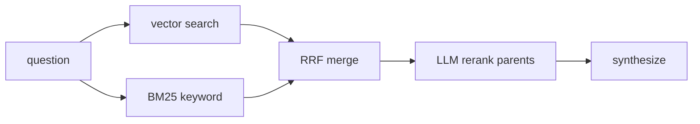

## Overview

Every RAG tutorial tells you to "use hybrid search" and "add a reranker." Few
show the measurement that justifies either. We built a pluggable retrieval layer
with three strategies and a deterministic benchmark — and the honest result is:
on our corpora, **all three modes tied**.

The negative result is the point. Here's the harness that proved it.

## The three modes

- **vector** — pure embedding similarity over child chunks.
- **hybrid** — keyword (BM25) + vector, fused with reciprocal rank fusion.
- **hybrid_rerank** — hybrid candidates, then an LLM reranks the parent sections
  before synthesis.

All three return deduplicated parent sections with their text and section title.

## The benchmark

Two things make a retrieval benchmark trustworthy:

1. **A deterministic metric.** We measure **hit-rate@5** (was the expected source
   in the top 5?) and **MRR** (mean reciprocal rank of the first correct hit). No
   LLM-as-judge noise, no API calls — fast, free, and stable.
2. **A hard query set.** Easy questions saturate and tell you nothing. So we
   generated a synthetic corpus: 80 near-duplicate policy documents, each with a
   unique reference code (`REF-9K2MNP`) and limit. Queries ask for exact codes.

## The results

Hit-rate@5:

| Corpus | vector | hybrid | hybrid_rerank |
|---|---|---|---|
| 16 curated docs, 16 Q | 1.00 | 1.00 | 1.00 |
| 80 synthetic docs, code + context | 0.95 | 0.95 | 0.95 |
| 80 synthetic docs, bare codes | 0.95 | 0.95 | 0.95 |

We expected vector to fall over on random tokens. It didn't.

## Why they tied

`text-embedding-3-large` is simply good. Our documents shared almost all their
text, so the only signal distinguishing them — the code — was also the dominant
signal in the embedding differences. Dense retrieval found the needle.

And hybrid can't *lose* to vector: it includes vector, plus a keyword leg. When
vector already recalls everything, hybrid has nothing to add. The reranker
reorders candidates, but recall was already 100% at rank 1 — **MRR was
saturated**, so reranking couldn't help either.

## What this actually means

- **Default to hybrid.** It never recalls less than vector and costs the same on
  Azure AI Search. It's insurance, not a silver bullet.
- **Rerank only when ranking is the bottleneck.** If hit-rate is high but
  top-1 accuracy (or answer quality) is not, a reranker earns its latency.
- **Measure on your data.** Retrieval-mode choice is empirical. Our result is
  specific to a small, clean, well-embedded corpus — yours may separate sharply.
  Now you have the harness to find out.

## Extras

- The benchmark runs with `SKIP_LLM_EVAL=1`, so it makes **zero** LLM calls.
- `QUERY_TYPE` filters the golden set (e.g. `exact_code_bare` vs `exact_code_context`).
- Ingestion is the only real cost (~320 vectors, cents).

## The takeaway

A negative result you can reproduce beats a cherry-picked win. The deliverable
isn't "hybrid is best" — it's a pluggable retrieval layer plus a deterministic
benchmark and a corpus generator you can point at your own data. That's the
difference between a demo and an engineering decision.

## Links

- Code: [enterprise-rag-pipeline](https://github.com/koatedevopskpai/enterprise-rag-pipeline) —
  `ragpipeline/strategies.py`, `ragpipeline/rerank.py`, `eval/compare_modes.py`,
  `scripts/generate_eval_corpus.py`
- Previous post: [Deploying RAG on Microsoft Foundry](/posts/data-mlops/001-foundry-rag-gotchas/)
- [Azure AI Search hybrid ranking (RRF)](https://learn.microsoft.com/azure/search/hybrid-search-ranking)
