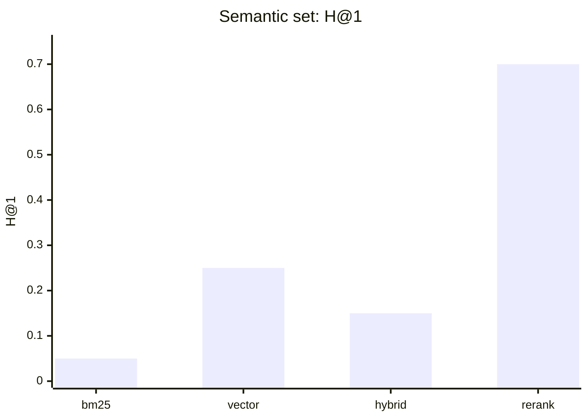
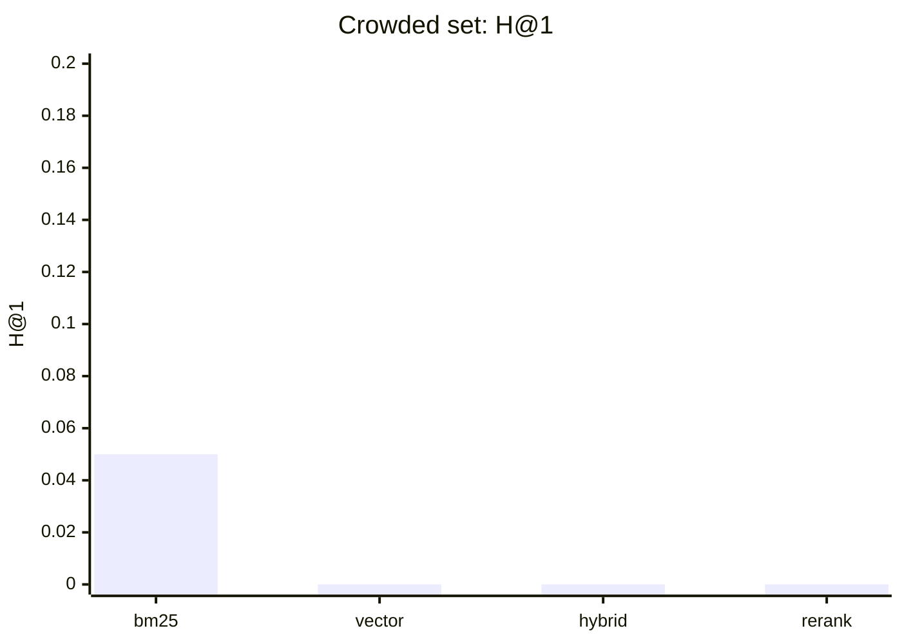

## Overview

In the previous benchmark (`002`), the LLM reranker cost ~1 s and gained nothing
— because every query set was lexical or near-saturated. Two reviewer caveats
followed: "the reranker's value is asserted, not demonstrated," and "these
queries are still lookup."

So we built the two sets that should actually exercise a reranker, using the
same harness and the same top-20-into-top-5 pool:

1. **Semantic paraphrases** — forty docs with genuinely different content, but
   queries that share almost no words with the target.
2. **Crowded near-duplicates** — forty docs built from identical boilerplate plus
   one unique clause; the query refers to the unique part by *synonym*, so all
   forty candidates score about equally.

The short version: **on the semantic set, the reranker is the only mode that
works (H@1 0.70 vs 0.25 for vector). On the crowded set, every mode fails —
because the needle never makes it into the candidate window.**

## The two sets

- **Semantic (low lexical overlap).** Doc: "This publishes a dashboard weekly
  update for the vendor audience." Query: "Which policy delivers a scoreboard for
  the partner firms every seven days?" Dashboard→scoreboard, vendor→partner,
  weekly→every seven days. No content token is shared; only meaning is.
- **Crowded (near-equal candidates).** Every doc contains the same standing-review
  paragraph, plus a unique line "Only one file references the lease requirement."
  Query: "Which submission mentions holding-pin handling in the standing review?"
  All forty docs match the shared paragraph; one matches the unique clause *by
  meaning* — but only if retrieval surfaces it.

Both use the corpus generator's new `--corpus semantic|crowded` modes.

## Results (40 docs, 20 queries each)

### Semantic paraphrases

| Mode | H@5 | H@1 | MRR | nDCG@5 |
|---|---|---|---|---|
| bm25 | 0.10 | 0.05 | 0.06 | 0.07 |
| vector | 0.55 | 0.25 | 0.38 | 0.42 |
| hybrid | 0.45 | 0.15 | 0.23 | 0.28 |
| hybrid_rerank | **0.95** | **0.70** | **0.80** | **0.84** |

### Crowded near-duplicates

| Mode | H@5 | H@1 | MRR | nDCG@5 |
|---|---|---|---|---|
| bm25 | 0.10 | 0.05 | 0.07 | 0.08 |
| vector | 0.15 | 0.00 | 0.06 | 0.08 |
| hybrid | 0.10 | 0.00 | 0.03 | 0.04 |
| hybrid_rerank | 0.10 | 0.00 | 0.03 | 0.04 |

(Reminder from the earlier post: p50 latency — bm25 ~0.6 s, vector ~1.3 s,
hybrid ~1.4 s, rerank ~2.4 s.)

## What this means

1. **A reranker is worth ~1 s when the pool is large-but-relevant and the needle
   is inside it.** On the semantic set, hybrid surfaced the right document
   somewhere in its window (H@5 0.45–0.55) but placed it poorly (H@1 ≤ 0.25). The
   reranker re-read the candidates and put the correct one first 70% of the time.
   That is the purpose-built case, and it is now demonstrated, not asserted.
2. **A reranker cannot fix retrieval recall.** On the crowded set the correct
   document rarely survives into the top-20 window at all, so re-ranking an empty
   (or near-empty) pool changes nothing. H@1 stays 0.00 for every mode. The
   lesson: grow or broaden the candidate pool before you blame ranking.
3. **BM25 collapses on paraphrases** (H@1 0.05) — confirming that low-overlap
   queries are genuinely semantic, and that the earlier "lookup" caveat was real.
4. **Hybrid lost to pure vector on paraphrases.** Adding the keyword leg actually
   *hurt* (H@1 0.15 vs 0.25) because paraphrase queries have few useful exact
   tokens and keyword noise dilutes RRF. Measure, don't assume "hybrid ≥ vector."

## Threats to validity

- **Synthetic content and a hand-built synonym table.** The semantic effect is
  tuned by my synonym choices; real logs and queries will differ.
- **Small sample (20 queries per set), no confidence intervals.**
- **Fixed top-20 window.** A different pool size changes rerank's ceiling on the
  crowded set — that is exactly the point of finding 2.
- **Latency is carried over from the prior local run** (serial, dev box), not
  re-measured per set.

## What I'd run next

- **Vary the candidate window** (top 10 / 20 / 40) on the crowded set to find
  where reranking starts to pay.
- **Real corpus**: index a slice of public Markdown (docs/ and FAQ) and build
  paraphrase + crowded queries from it.
- **Larger n + confidence intervals** for H@1 / MRR / nDCG.

The generator already exposes `--corpus`, `--docs`, and `--queries`; the harness
`compare_modes.py` accepts any `--golden` set and prints all four metrics.

## Links

- Code: [enterprise-rag-pipeline](https://github.com/koatedevopskpai/enterprise-rag-pipeline) —
  `scripts/generate_eval_corpus.py` (now `--corpus semantic|crowded`),
  `eval/compare_modes.py`
- Previous: [Four retrieval modes, benchmarked](/posts/data-mlops/002-retrieval-mode-benchmark-four-modes/)
- First in series: [Deploying RAG on Microsoft Foundry](/posts/data-mlops/001-foundry-rag-gotchas/)