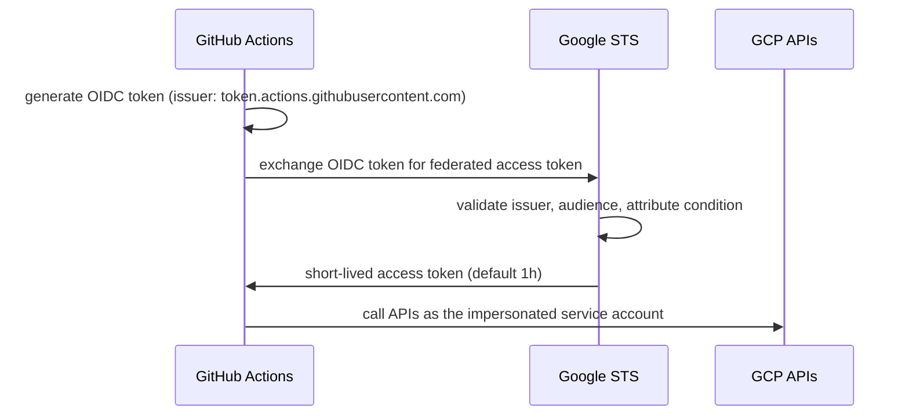

import Callout from "../../../components/Callout.astro";

<Callout type="warn" title="The production problem this solves">
If your GitHub Actions workflow reaches GCP with a service account JSON key
stored in GitHub Secrets, you have three problems: **the key never expires**,
**you can't tell who used it**, and **if it leaks, every resource that account
can reach is compromised**. Workload Identity Federation removes all three.
</Callout>

**In one line:** replace the static CI key with short-lived, repo-scoped,
auditable credentials — and prove it works.

- **Who this is for:** GCP platform / DevOps engineers who deploy from CI and
  have to pass a security review.
- **What you get:** working Terraform (pool, provider, attribute condition,
  least-privilege service account), a keyless workflow, a failure-mode table,
  and a revocation playbook.
- **Proof level:** **tier 2** — the Terraform applies for real and the workflow
  authenticates for real. (Tiers: 1 = live run with metrics, 2 = code applied,
  3 = reference.)

`GitHub repo → GitHub Actions → OIDC token → GCP STS → short-lived credentials → GCP APIs`

## Why this matters in production

Service account keys are the most common long-lived credential leak in GCP. They
never expire, they're easy to copy into CI secrets, and once compromised they
work from anywhere on the internet.

**Workload Identity Federation (WIF)** removes them entirely. GitHub Actions
issues a short-lived OIDC token per workflow run; WIF lets GCP trust that token
directly and hand back short-lived Google credentials — no key file, nothing to
rotate.

What that changes day to day:

| Daily pain | Service account key | Workload Identity Federation |
|---|---|---|
| Credential lifetime | Months to years | ~1 hour (short-lived) |
| Rotation | Manual, easy to forget | None — nothing to rotate |
| Blast radius if leaked | Whole project, usable from anywhere | Nothing to steal |
| Audit trail | "a service account was used" | Repo, branch, workflow, actor in the OIDC claims |
| Scope | Usually broad (`editor`) | One repo, one SA, explicit roles |
| Security review / compliance | Compensating controls required | Native — no static credentials |
| Revocation | Delete the key, hope nothing breaks | Delete one IAM binding |

## What this replaces

Most CI pipelines start here — a key that gets pasted into secrets:

```hcl
# ❌ The anti-pattern: a long-lived key you must store and rotate
resource "google_service_account_key" "ci" {
  service_account_id = google_service_account.ci.name
}
# → copy the base64 JSON into GitHub Secrets and hope it never leaks
```

This post builds the replacement — no key exists at any point:

```hcl
# ✅ Keyless: GitHub's OIDC token is exchanged for short-lived credentials
resource "google_iam_workload_identity_pool" "github" { ... }
resource "google_iam_workload_identity_pool_provider" "github" { ... }
resource "google_service_account_iam_member" "wif_user" { ... }
```

## Architecture



The trust path is: **OIDC token → STS → service account impersonation → API call.**
No static secret exists at any step.

## Prerequisites

- A GCP project with billing enabled and `gcloud` authenticated as project owner.
- Terraform >= 1.5 and the `google` provider ~> 6.0.
- A GitHub repository you control.
- Your project **number** (not just the ID) — WIF provider paths use it:

```bash
gcloud projects describe YOUR_PROJECT_ID --format='value(projectNumber)'
```

## Steps

### 1. Create the workload identity pool and GitHub OIDC provider

The pool is the container; the provider describes *how* to validate GitHub's
tokens and *what* attributes to extract from the claims.

```hcl
resource "google_iam_workload_identity_pool" "github" {
  workload_identity_pool_id = "github-pool"
  display_name              = "GitHub Actions pool"
  description               = "Federated identities for GitHub Actions CI"
}

resource "google_iam_workload_identity_pool_provider" "github" {
  workload_identity_pool_id          = google_iam_workload_identity_pool.github.workload_identity_pool_id
  workload_identity_pool_provider_id = "github"
  display_name                       = "GitHub OIDC provider"

  attribute_mapping = {
    "google.subject"       = "assertion.sub"
    "attribute.actor"      = "assertion.actor"
    "attribute.repository" = "assertion.repository"
    "attribute.ref"        = "assertion.ref"
  }

  # Lock the trust down to a single repository.
  attribute_condition = "assertion.repository == 'OWNER/REPO'"

  oidc {
    issuer_uri = "https://token.actions.githubusercontent.com"
  }
}
```

<Callout type="warn" title="The attribute condition is the security boundary">
Without `attribute_condition`, *any* GitHub repository in the world can present a
token to this provider. The condition is what turns "GitHub" into "my repository
on this branch". **Treat it as mandatory.**
</Callout>

<Callout type="tip" title="HCL vs CEL quoting">
The `attribute_condition` value is an HCL string (double quotes) containing a CEL
expression (single quotes): `"assertion.repository == 'OWNER/REPO'"`. Don't swap
them, or `terraform apply` will fail.
</Callout>

### 2. Create a least-privilege service account

The workflow impersonates this identity. Grant it only what the deploy needs.

```hcl
resource "google_service_account" "github_ci" {
  account_id   = "github-ci"
  display_name = "GitHub Actions CI"
  description  = "Impersonated by GitHub Actions via Workload Identity Federation"
}

# Example deploy permissions — trim to exactly what your pipeline needs.
resource "google_project_iam_member" "github_ci_run_admin" {
  project = var.project_id
  role    = "roles/run.admin"
  member  = "serviceAccount:${google_service_account.github_ci.email}"
}

resource "google_project_iam_member" "github_ci_ar_writer" {
  project = var.project_id
  role    = "roles/artifactregistry.writer"
  member  = "serviceAccount:${google_service_account.github_ci.email}"
}

# The identity the DEPLOYED workload runs as — separate from the CI identity.
resource "google_service_account" "cloud_run_runtime" {
  account_id   = "cloud-run-runtime"
  display_name = "Cloud Run runtime"
}

# The CI SA may deploy a workload that runs as the runtime SA.
# Note: bind this on the RUNTIME SA, not on the CI SA itself.
resource "google_service_account_iam_member" "github_ci_can_act_as_runtime" {
  service_account_id = google_service_account.cloud_run_runtime.name
  role               = "roles/iam.serviceAccountUser"
  member             = "serviceAccount:${google_service_account.github_ci.email}"
}
```

### 3. Bind the repository principal to the service account

This is the step people get wrong. You don't bind a *user* — you bind a
**principalSet** whose members carry the `attribute.repository` claim.

```hcl
resource "google_service_account_iam_member" "wif_user" {
  service_account_id = google_service_account.github_ci.name
  role               = "roles/iam.workloadIdentityUser"
  member             = "principalSet://iam.googleapis.com/${google_iam_workload_identity_pool.github.name}/attribute.repository/OWNER/REPO"
}
```

`google_iam_workload_identity_pool.github.name` expands to
`projects/<PROJECT_NUMBER>/locations/global/workloadIdentityPools/github-pool`,
so the full member is:

```
principalSet://iam.googleapis.com/projects/123456789/locations/global/workloadIdentityPools/github-pool/attribute.repository/OWNER/REPO
```

### 4. Read the provider path from Terraform output

The workflow needs the full provider resource name. Export it rather than
hand-assembling it:

```hcl
output "workload_identity_provider" {
  description = "Full resource name for google-github-actions/auth"
  value       = google_iam_workload_identity_pool_provider.github.name
}

output "service_account_email" {
  value = google_service_account.github_ci.email
}
```

```bash
terraform apply
terraform output -raw workload_identity_provider
# projects/123456789/locations/global/workloadIdentityPools/github-pool/providers/github
```

### 5. Authenticate from GitHub Actions

Two things make this work: `id-token: write` permission, and the auth action.
There is **no secret** in the workflow.

```yaml
name: deploy
on:
  push:
    branches: [main]

permissions:
  contents: read
  id-token: write # REQUIRED: lets the job mint the OIDC token

jobs:
  deploy:
    runs-on: ubuntu-latest
    steps:
      - uses: actions/checkout@v4

      - id: auth
        uses: google-github-actions/auth@v2
        with:
          workload_identity_provider: projects/123456789/locations/global/workloadIdentityPools/github-pool/providers/github
          service_account: github-ci@YOUR_PROJECT_ID.iam.gserviceaccount.com

      - uses: google-github-actions/setup-gcloud@v2

      - name: Prove we are the service account
        run: |
          gcloud auth list
          # Any read the SA's roles allow; run.admin covers run.services.list.
          gcloud run services list --region=us-central1
```

<Callout type="note" title="Credentials are automatic">
`google-github-actions/auth` writes the federated credential to
`$GOOGLE_APPLICATION_CREDENTIALS` and configures `gcloud`. Subsequent steps and
client libraries pick it up with no extra configuration.
</Callout>

### 6. Verify it works

Run the workflow and confirm the authenticated identity:

```bash
gcloud auth list
#   ACTIVE  ACCOUNT
#   *       github-ci@YOUR_PROJECT_ID.iam.gserviceaccount.com
```

If it fails, the error almost always maps to one of these:

| Error | Cause | Fix |
|---|---|---|
| `unauthorized_client` / `invalid_grant` | `attribute_condition` didn't match the token | Check `assertion.repository` — it's `OWNER/REPO`, case-sensitive |
| `Permission 'iam.serviceAccounts.getAccessToken' denied` | Missing `roles/iam.workloadIdentityUser` on the SA | Re-check the `principalSet` member |
| `Could not fetch the default credentials` | Missing `id-token: write` | Add the permission to the job |
| `The audience ... is invalid` | Token `aud` doesn't match the provider's allowed audiences | Leave `allowed_audiences` unset — the default expects the token `aud` to equal the full provider resource name. If you set a custom audience in the workflow, add it here too |
| `IAM Service Account Credentials API has not been used` | `iamcredentials.googleapis.com` not enabled | Enable it (and `sts.googleapis.com`) |
| `principal ... not found` | Used `principal://` instead of `principalSet://` | Repo principals are **`principalSet`** |
| `Invalid provider` / `NOT_FOUND` | Wrong provider path in the workflow | Use `terraform output -raw workload_identity_provider` verbatim |
| Condition never matches | `attribute_condition` references a claim that isn't in `attribute_mapping` (e.g. `assertion.repository_name`) | Keep the mapping key and the condition in sync — both use `assertion.repository` |

## Operating it in production

Getting it working is step one; these are the things that keep it safe on an
on-call rota.

### If GitHub's OIDC issuer is down

`token.actions.githubusercontent.com` is a single point of trust: if it's
unreachable, no workflow can mint a token, so no workflow can authenticate. This
is a GitHub-side outage, not a GCP one. Design your release cadence so a GitHub
outage is a *delay*, not a capability loss — and keep a documented **break-glass**
path (a short-lived, manually-approved key or an operator impersonation) for
genuine emergencies. State this rather than hide it; it's the first thing an
enterprise reviewer asks for.

### Audit: who deployed, from where

Every federated call appears in Cloud Audit Logs attributed to the service
account, with the OIDC claims preserved. Query it:

```bash
gcloud logging read \
  'protoPayload.authenticationInfo.principalEmail="github-ci@YOUR_PROJECT_ID.iam.gserviceaccount.com"' \
  --limit 20 --format='table(timestamp, protoPayload.methodName)'
```

Because the trust is scoped by the attribute condition, the claims tell you the
*repository* and *ref* behind each call — a stronger trail than "a key was used".

### Monitor: alert on failed exchanges

A spike in failed token exchanges usually means a broken condition or someone
probing your provider. Create a log-based metric on STS errors and alert on it:

```hcl
resource "google_logging_metric" "wif_auth_failures" {
  name   = "wif_auth_failures"
  filter = "resource.type=\"audited_resource\" AND protoPayload.status.code != 0 AND protoPayload.serviceName=\"sts.googleapis.com\""

  metric_descriptor {
    metric_kind = "DELTA"
    value_type  = "INT64"
  }
}
```

Point an alert policy at that metric, and add the Workload Identity Pool to your
dashboard so token exchange volume is visible at a glance.

### Revocation playbook

When you need to cut access, do the smallest thing that fixes it:

| Situation | Action | Effect |
|---|---|---|
| One repo is compromised | Tighten `attribute_condition` (pin branch or environment) | Only that repo loses access |
| A whole repo must be cut off | Delete the `google_service_account_iam_member` binding | That repo can no longer impersonate |
| Suspected provider abuse | Disable/delete the pool provider | All repos using it lose access |
| Contain everything | Delete the pool | Every federated identity is gone |
| SA may have other users | Disable/rotate the service account | Isolates the CI identity |

Because there is no long-lived secret, revocation is authoritative and
immediate — the next workflow run simply fails to authenticate.

## Extras

### Tighten the condition further

`attribute.repository` locks the repo. Add more claims for defence in depth:

```hcl
# Only the main branch
attribute_condition = "assertion.repository == 'OWNER/REPO' && assertion.ref == 'refs/heads/main'"

# Only a protected GitHub Environment (best for prod)
attribute_condition = "assertion.repository == 'OWNER/REPO' && assertion.environment == 'production'"
```

The environment variant pairs well with GitHub's required reviewers: the token
is only issued *after* approval.

### Multiple repositories, one pool

Keep one pool and add a binding per repo — no need to duplicate the provider:

```hcl
resource "google_service_account_iam_member" "wif_user" {
  for_each           = toset(["ORG/app-a", "ORG/app-b"])
  service_account_id = google_service_account.github_ci.name
  role               = "roles/iam.workloadIdentityUser"
  member             = "principalSet://iam.googleapis.com/${google_iam_workload_identity_pool.github.name}/attribute.repository/${each.key}"
}
```

### Enforce keyless at the organisation level

Stop anyone re-introducing keys:

```hcl
# Org Policy v2 (the v1 google_project_organization_policy resource is deprecated)
resource "google_org_policy_policy" "disable_sa_keys" {
  name   = "projects/${var.project_id}/policies/iam.disableServiceAccountKeyCreation"
  parent = "projects/${var.project_id}"

  spec {
    rules {
      enforce = "TRUE"
    }
  }
}
```

<Callout type="note">
This must not be overridden at the folder or organization level, or the
project-level rule has no effect.
</Callout>

## What changes at scale

The single-pool, single-provider, single-SA pattern above is right for one repo.
At 10, 50, or 200 repos the shape changes — not the trust model, but the blast
radius, the audit surface, and who owns it. Here's what I'd do differently.

### 1. One pool per environment, not one pool for everything

Google's guidance is explicit: create a separate workload identity pool for each
non-GCP environment — dev, staging, prod. A pool is a trust boundary. If dev and
prod share one, a bad dev condition can, in combination with a bad IAM binding,
mint a principal that impersonates a prod SA. Separate pools make that class of
mistake structurally impossible.

```hcl
locals {
  environments = {
    dev  = { project = var.dev_project_id,  repo = "ORG/app" }
    prod = { project = var.prod_project_id, repo = "ORG/app" }
  }
}

resource "google_iam_workload_identity_pool" "github" {
  for_each                  = local.environments
  project                   = each.value.project
  workload_identity_pool_id = "github-${each.key}"
  display_name              = "GitHub Actions (${each.key})"
}

resource "google_iam_workload_identity_pool_provider" "github" {
  for_each                           = local.environments
  project                            = each.value.project
  workload_identity_pool_id          = google_iam_workload_identity_pool.github[each.key].workload_identity_pool_id
  workload_identity_pool_provider_id = "github"

  attribute_mapping = {
    "google.subject"        = "assertion.sub"
    "attribute.repository"  = "assertion.repository"
    "attribute.environment" = "assertion.environment"
  }

  attribute_condition = "assertion.repository == '${each.value.repo}'"

  oidc {
    issuer_uri = "https://token.actions.githubusercontent.com"
  }
}
```

### 2. Pin the environment claim, not the branch

At small scale `attribute.repository == 'ORG/REPO'` feels sufficient. It isn't.
Pinning `refs/heads/main` only proves which branch the *workflow file* came from
— any workflow can run on `main`, including a scheduled job that reads untrusted
input. It still gets a valid token, because the repository claim matches.

Pin `assertion.environment` instead. GitHub only includes the `environment` claim
when a job explicitly declares `environment:` in the workflow, which is exactly
what triggers GitHub's protection rules (required reviewers, wait timers, branch
policy). It's a superset of branch pinning:

```hcl
attribute_condition = "assertion.repository == 'ORG/REPO' && assertion.environment == 'production'"
```

Narrow the IAM member to the environment-scoped subject as a second lock:

```hcl
resource "google_service_account_iam_member" "wif_user" {
  service_account_id = google_service_account.github_ci.name
  role               = "roles/iam.workloadIdentityUser"
  member             = "principal://iam.googleapis.com/${google_iam_workload_identity_pool.github.name}/subject/repo:ORG/REPO:environment:production"
}
```

`principal://` (a specific subject) is tighter than `principalSet://` (an
attribute set): it answers "which exact workflow runs can impersonate this SA?"
with one auditable value.

### 3. Pool granularity: pick by scale signal

| Scale signal | Pool strategy |
|---|---|
| 1–5 repos, 1 team | One pool per environment |
| 5–20 repos, 2–3 teams | One pool per environment per team |
| 20+ repos, multiple BUs | One pool per environment per business unit |
| Regulated (PCI, HIPAA, FedRAMP) | One pool per environment per compliance boundary |

Each pool is its own audit stream, so an auditor's "who can deploy to prod for
the payments team?" becomes one query instead of a two-day investigation. The
tradeoff is more state and more bindings — under ~20 repos, per-environment is
usually enough.

### 4. Separate service accounts per environment — never share

The `github-ci` SA with broad roles is fine for one project; at scale it's a
finding. Use one SA per environment, in that environment's project, and make the
prod SA *narrower* than dev:

| Environment | Service account | Roles |
|---|---|---|
| Dev | `github-ci-dev@<dev-project>` | `roles/run.admin`, `roles/artifactregistry.writer` (dev only) |
| Prod | `github-ci-prod@<prod-project>` | `roles/run.developer` + `roles/iam.serviceAccountUser` on one runtime SA |

Prod deploys should update existing services, not create new ones. The SA is your
audit anchor: `principalEmail` in Cloud Audit Logs tells you which environment's
workflow fired.

### 5. Centralize the pool, decentralize the service accounts

Google recommends a dedicated project for pools/providers; keep service accounts
in the projects that hold the resources. The IAM binding bridges them.

```hcl
# Hub project: pool (and provider)
resource "google_iam_workload_identity_pool" "github" {
  project                   = var.wif_project_id
  workload_identity_pool_id = "github-pool"
}

# Spoke project: service account
resource "google_service_account" "github_ci" {
  project    = var.workload_project_id
  account_id = "github-ci"
}

# Cross-project binding: pool principal -> spoke SA
resource "google_service_account_iam_member" "wif_user" {
  service_account_id = google_service_account.github_ci.name
  role               = "roles/iam.workloadIdentityUser"
  member             = "principalSet://iam.googleapis.com/${google_iam_workload_identity_pool.github.name}/attribute.repository/ORG/REPO"
}
```

Adding a repo is one binding; adding an environment is one SA. The hub stays
stable. Caveat: the WIF project is now a tier-0 dependency — back up its state,
alert on pool deletion, and document the break-glass path.

### 6. Make the attribute condition a managed policy

At 5 repos, conditions live in each repo. At 50, nobody knows the current policy.
Centralize the condition in a module all repos consume, so repos can't drift:

```hcl
module "github_wif" {
  source = "git::https://github.com/ORG/terraform-gcp-wif.git//modules/github-repo"

  repo         = "ORG/app"
  environment  = "production"
  project_id   = var.prod_project_id
  allowed_refs = ["refs/heads/main"]
}
```

Update the module once, roll it out everywhere. It's the same golden-path idea as
your service templates: the paved road includes the *auth* config, not just the
app config.

### 7. Incident response: which pool did that deploy come from?

With per-environment (and per-BU) pools, one query tells dev from prod:

```bash
gcloud logging read \
  'protoPayload.authenticationInfo.principalEmail="github-ci-prod@PROD_PROJECT.iam.gserviceaccount.com"' \
  --format='table(timestamp, protoPayload.methodName)'
```

Without pool separation, that query returns every environment and you correlate
timestamps by hand.

### 8. What doesn't change at scale

- **The trust path** — OIDC token → STS → SA impersonation → API call.
- **The failure modes** — every row in the table above still applies.
- **The revocation mechanics** — one binding revokes one repo; one pool revokes
  everything that trusts it. Separation improves *granularity*, not mechanics.

The scale story is blast-radius control, not a new mechanism.

### 9. Migration path: don't refactor WIF at 2am

1. Create the new pool alongside the old one (delete nothing).
2. Add the new IAM binding for the first repo.
3. Point that repo's workflow at the new provider; run and verify.
4. Remove the old binding for that repo.
5. Repeat per repo.
6. Delete the old pool only after the last repo has run a full release cycle.

Old and new pools coexist indefinitely, and both are free.

> At one repo, WIF is a key replacement. At 50, it's a trust-boundary
> architecture — and the decisions above (pool per environment, environment-pinned
> conditions, separate SAs, centralized pool with decentralized SAs) are what
> decide whether your security reviewer smiles or schedules a follow-up.

## SLO / Security / FinOps notes

- **Security:** no static credential exists; tokens expire in ~1 hour and are
  scoped by the attribute condition. Revoking trust is deleting one IAM binding.
- **Cost:** the token exchange, WIF, and IAM are **free** — at ~10,000 runs/day
  the exchange volume is invisible on the bill. The saving is indirect: no
  key-rotation tooling, fewer secret-scanning false positives, and no
  incident-response cost from a leaked key.
- **Auditability:** every impersonation shows up in Cloud Audit Logs as the
  service account, with the OIDC subject recorded — traceable to a workflow run.

## What this doesn't solve

WIF answers *CI authentication* only. It does not cover:

- **Runtime identity** for your deployed services — that's a separate runtime
  service account (step 2) and, on GKE, Workload Identity Federation for GKE.
- **Human / user authentication** — that's Workforce Identity Federation or IAP.
- **Authorization** — federating the right identity doesn't grant the right
  permissions; that's IAM and least privilege.

Each of those is its own post in this series.

## Reproduce

The full working Terraform and the sample workflow are in the companion
example: [`examples/workload-identity-federation-github-to-gcp`](https://github.com/koatedevopskpai/gcp-architect-blog/tree/main/examples/workload-identity-federation-github-to-gcp).

```bash
gcloud config set project YOUR_PROJECT_ID
terraform -chdir=examples/workload-identity-federation-github-to-gcp apply \
  -var="project_id=YOUR_PROJECT_ID" -var="github_repo=OWNER/REPO"
```

## Where this fits: Google Cloud Well-Architected Framework

This pattern is a direct implementation of the **Security, privacy, and
compliance** pillar of the [Google Cloud Well-Architected
Framework](https://cloud.google.com/architecture/framework/security):

| Framework principle | How this post applies it |
|---|---|
| Implement security by design | Keyless trust is the default — no long-lived credential ever exists |
| Implement zero trust | Every workflow run is independently verified via OIDC; nothing is implicitly trusted |
| Identity and access management | A dedicated, least-privilege service account, impersonated per run |
| Replace long-lived credentials | Service account keys are eliminated in favour of short-lived tokens |

Google's own guidance is explicit here: Workload Identity Federation
"eliminates the maintenance and security burden associated with service account
keys," and is "the preferred way to configure identities for external
workloads" (see references below).

## References and further reading

### Google Cloud — official guidance

- [Google Cloud Well-Architected Framework — Security, privacy, and compliance pillar](https://cloud.google.com/architecture/framework/security)
- [Workload Identity Federation — overview](https://cloud.google.com/iam/docs/workload-identity-federation)
- [Best practices for using Workload Identity Federation](https://cloud.google.com/iam/docs/best-practices-for-using-workload-identity-federation)
- [Configure Workload Identity Federation with deployment pipelines (GitHub, GitLab, Terraform)](https://cloud.google.com/iam/docs/workload-identity-federation-with-deployment-pipelines)
- [Identities for workloads](https://cloud.google.com/iam/docs/workload-identities)
- [Google Cloud security foundations guide](https://cloud.google.com/architecture/security-foundations)

### Google Cloud blog

- [Enable keyless access to GCP with Workload Identity Federation (2021)](https://cloud.google.com/blog/products/identity-security/enable-keyless-access-to-gcp-with-workload-identity-federation)
- [Secure your use of third-party tools with identity federation (2023)](https://cloud.google.com/blog/products/identity-security/secure-your-use-of-third-party-tools-with-identity-federation)

### Other writers and community

- [Keyless authentication to GCP using Workload Identity Federation — Avinash Jha](https://medium.com/google-cloud/keyless-authentication-to-google-cloud-platform-using-workload-identity-federation-5c41043acefb)
- [CI/CD on GitHub Actions: enabling keyless authentication and Workload Identity Federation](https://medium.com/google-cloud/ci-cd-on-github-actions-enabling-keyless-authentication-and-workload-identity-f55efb95343c)
- [Solving Workload Identity "sameness" with IAM Conditions — Abdel Sghiouar (Google)](https://medium.com/google-cloud/solving-the-workload-identity-sameness-with-iam-conditions-c02eba2b0c13)
- [GitHub — Configuring OpenID Connect in Google Cloud Platform](https://docs.github.com/en/actions/deployment/security-hardening-your-deployments/configuring-openid-connect-in-google-cloud-platform)
- [NIST SP 800-207 — Zero Trust Architecture](https://csrc.nist.gov/pubs/sp/800/207/final)

### Tools

- [google-github-actions/auth](https://github.com/google-github-actions/auth)
- [google_iam_workload_identity_pool_provider — Terraform](https://registry.terraform.io/providers/hashicorp/google/latest/docs/resources/iam_workload_identity_pool_provider)
